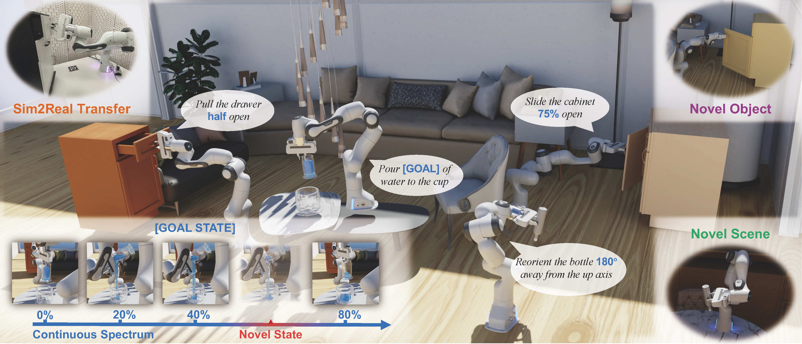

# New Guide 2025 

## 0. Download Dataset

Download from [Google Drive](https://drive.google.com/drive/folders/1yaEItqU9_MdFVQmkKA6qSvfXy_cPnKGA).

**Task data** (e.g. `pickup_object`, `reorient_object`, etc.): download and unzip each task folder into `./data/`.

**Assets** (`sample` and `materials`): download and unzip into `./asset/`.

After extraction, your directory structure should look like:

```
arnold/
├── data/
│   ├── pickup_object/
│   │   ├── train/
│   │   └── test/
│   ├── reorient_object/
│   ├── open_drawer/
│   └── ...
├── asset/
│   ├── sample/
│   │   └── light/
│   │       └── skylight.usd
│   └── materials/
│       └── ...
└── ...
```

## 1. Installation

### Prerequisites

Install Isaac Lab 2.3.2: Follow the [installation guide](https://isaac-sim.github.io/IsaacLab/v2.3.1/source/setup/installation/index.html). Note that Isaac Sim 5.1 is required to use the verified USD provided in this project. We recommend using the conda installation. Remember to check out the specific branch as follows.

```bash
# Ensure you're using version 2.3.2
git checkout v2.3.2
```


### Local Development Setup

For local development on your machine:

```
# Ensure ISAACLAB_PATH is set
export ISAACLAB_PATH=/path/to/isaac_lab
## e.g.
## export ISAACLAB_PATH=/home/yizzhao/Projects/IsaacLab 
## export ISAACLAB_PATH=/home/linfan/Projects/IsaacLab/IsaacLab

# Install all dependencies and packages
./scripts/setup/install_deps_local.sh

```


## 2. Command
```sh
python renewed_eval.py --task=pickup_object --mode=eval --use_gt 1 1 --visualize
```

```python
import isaaclab.sim as sim_utils
simulation_context = sim_utils.SimulationContext.instance()
for _ in range(200):
    print("step", _)
    simulation_context.step(render=True)
```


<h2 align="center">
  <b><tt>ARNOLD</tt>: A Benchmark for Language-Grounded Task Learning With Continuous States in Realistic 3D Scenes</b>
</h2>

<div align="center" margin-bottom="6em">
<b>ICCV 2023</b>
</div>

<div align="center" margin-bottom="6em">
Ran Gong<sup>✶</sup>, Jiangyong Huang<sup>✶</sup>, Yizhou Zhao, Haoran Geng, Xiaofeng Gao, Qingyang Wu <br/> Wensi Ai, Ziheng Zhou, Demetri Terzopoulos, Song-Chun Zhu, Baoxiong Jia, Siyuan Huang
</div>
&nbsp;

<div align="center">
    <a href="https://arxiv.org/abs/2304.04321" target="_blank">
    </a>
    <a href="https://arnold-benchmark.github.io" target="_blank">
    </a>
    <a href="https://arnold-docs.readthedocs.io/en/latest/" target="_blank">
    </a>
    <a href="https://drive.google.com/drive/folders/1yaEItqU9_MdFVQmkKA6qSvfXy_cPnKGA?usp=sharing" target="_blank">
    </a>
    <a href="https://pytorch.org" target="_blank">
    </a>
    <a href="https://sites.google.com/view/arnoldchallenge/" target="_blank">
    </a>
</div>
&nbsp;



**[News]** We host the [ARNOLD Challenge](https://sites.google.com/view/arnoldchallenge/) on [CVPR 2024 Embodied AI Workshop](https://embodied-ai.org/). Welcome to participate.

We present <tt>ARNOLD</tt>, a benchmark for **language-grounded** task learning with **continuous states** in **realistic 3D scenes**. We highlight the following major points:
- <tt>ARNOLD</tt> is built on <tt>NVIDIA Isaac Sim</tt>, equipped with **photo-realistic** and **physically-accurate** simulation, covering **40 distinctive objects** and **20 scenes**.
- <tt>ARNOLD</tt> is comprised of **8 language-conditioned tasks** that involve understanding object states and learning policies for continuous goals. For each task, there are **7 data splits**, including **unseen generalization**.
- <tt>ARNOLD</tt> provides **10k expert demonstrations** with diverse template-generated language instructions, based on thousands of human annotations.
- We assess the task performances of the latest language-conditioned policy learning models. The results indicate that current models for language-conditioned manipulation **still struggle in understanding continuous states and producing precise motion control**. We hope these findings can foster future research to address the unsolved challenges in **instruction grounding** and **precise continuous motion control**.

We provide brief guidance on this page. Please refer to [our documentation](https://arnold-docs.readthedocs.io/en/latest/) for more information about <tt>ARNOLD</tt>.

## Get Started
There are two setup approaches: docker-based and conda-based. We recommend the docker-based approach as it wraps everything up and is friendly to users. See step-by-step instructions [here](https://arnold-docs.readthedocs.io/en/latest/tutorial/setup/index.html#setup).

After setup, you can refer to [quickstart](https://arnold-docs.readthedocs.io/en/latest/tutorial/setup/index.html#quickstart) for a glance of using <tt>ARNOLD</tt>.

Major components of the <tt>ARNOLD</tt> environment are introduced [here](https://arnold-docs.readthedocs.io/en/latest/tutorial/environment/index.html#environment). Based on this environment, you can check the [tasks](https://arnold-docs.readthedocs.io/en/latest/tutorial/tasks/index.html#tasks) and [data](https://arnold-docs.readthedocs.io/en/latest/tutorial/data/index.html#data).

We use `hydra` for configurations of the experiments. See [configs](https://arnold-docs.readthedocs.io/en/latest/tutorial/configs/index.html#configs). After double-checking the configurations, you can explore the [training] and [evaluation] on your own.

## TODO
- Demonstration generator.

## BibTex
```bibtex
@inproceedings{gong2023arnold,
  title={ARNOLD: A Benchmark for Language-Grounded Task Learning With Continuous States in Realistic 3D Scenes},
  author={Gong, Ran and Huang, Jiangyong and Zhao, Yizhou and Geng, Haoran and Gao, Xiaofeng and Wu, Qingyang and Ai, Wensi and Zhou, Ziheng and Terzopoulos, Demetri and Zhu, Song-Chun and others},
  booktitle={Proceedings of the IEEE/CVF International Conference on Computer Vision (ICCV)},
  year={2023}
}
```
